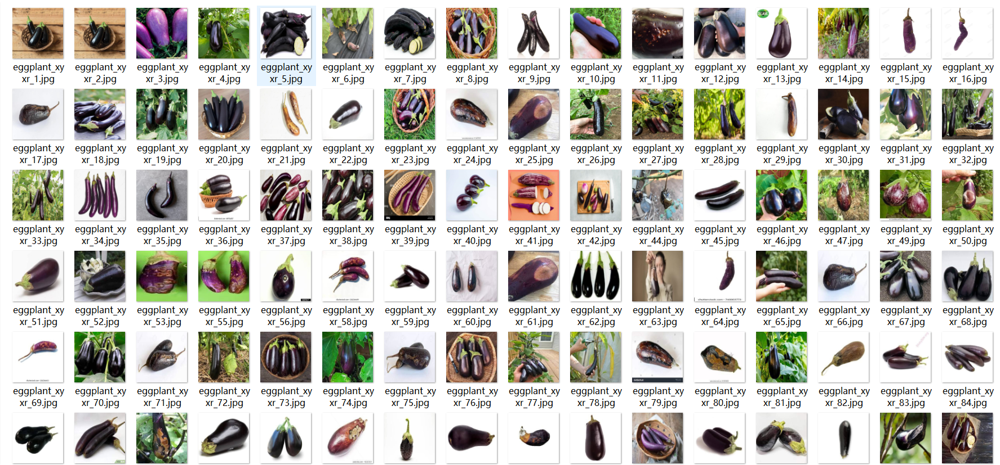
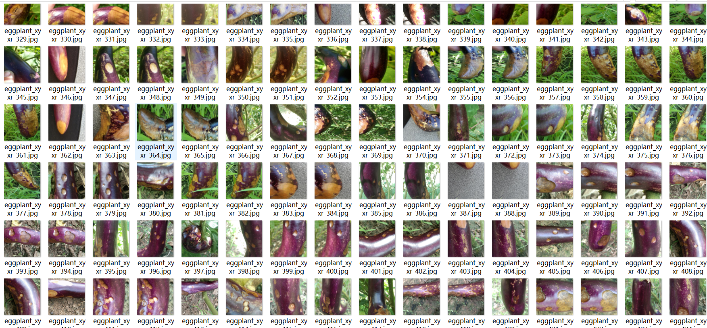

# [Object Detection] Eggplant Good or bad quality Detection Dataset 450 imagesVOC+YOLO format2 typesClasses

Dataset Description: ~

Dataset format: Pascal VOC format + YOLO format (the txt file does not contain the split path, it only contains jpg images and corresponding VOC format xml files and yolo format txt files)

Number of images (number of jpg files): 454

Number of annotations (number of xml files): 454

Number of annotations (number of txt files): 454

Label count: 2

Annotation class names: ["badeggplant","goodeggplant"]

Number of boxes labeled in each category:

badeggplant frame count = 869

goodeggplant frame count = 534

Total frame count: 1403

Use the labeling tool: labelImg

## Images

---

Here is a pay link on Stripe (https://buy.stripe.com/3cs8yP7sY87d0vu9AB). Please contact me lonlonago@foxmail.com after funding $89, and I will send you a complete data files, thank you!

